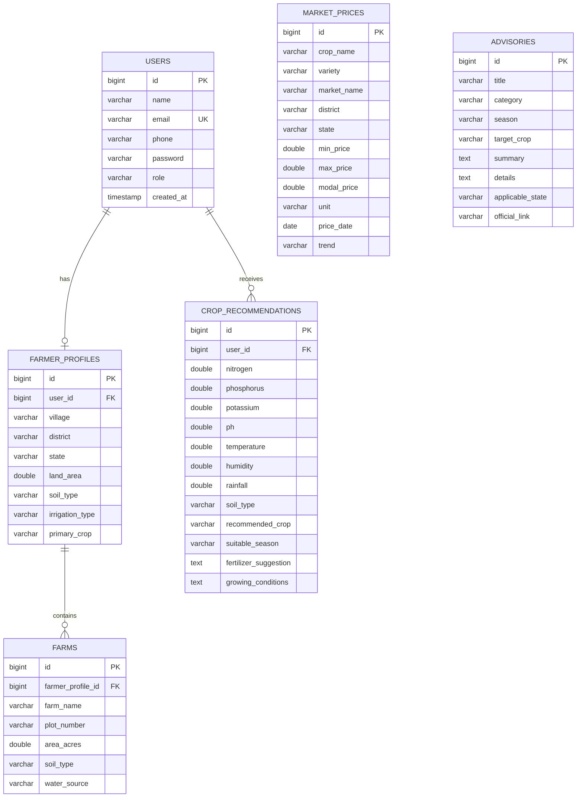

# Software Requirements Specification (SRS)
## Smart Krishi – Precision Agriculture Platform

**Document Version:** 2.0  
**Status:** Approved & Verified  
**Date:** October 2026  
**Application Scope:** Web & Mobile Responsive Precision Agriculture Platform  
**Target Environment:** Local Development (H2/Node/Spring Boot) & Cloud Production (Netlify/Render/MySQL 8.0+)  

---

## Table of Contents
1. [Introduction](#1-introduction)
   - 1.1 Purpose
   - 1.2 Document Conventions
   - 1.3 Intended Audience
   - 1.4 Project Scope
   - 1.5 References
2. [Overall Description](#2-overall-description)
   - 2.1 Product Perspective & Context
   - 2.2 Product Functional Summary
   - 2.3 User Classes and Characteristics
   - 2.4 Operating Environment
   - 2.5 Design and Implementation Constraints
   - 2.6 Assumptions and Dependencies
3. [External Interface Requirements](#3-external-interface-requirements)
   - 3.1 User Interfaces (UI/UX)
   - 3.2 Hardware Interfaces
   - 3.3 Software Interfaces (External APIs)
   - 3.4 Communications Interfaces
4. [Detailed System Features & Functional Requirements](#4-detailed-system-features--functional-requirements)
   - 4.1 Module 1: Farmer Management & Land Profiling
   - 4.2 Module 2: Precision Crop Recommendation Engine
   - 4.3 Module 3: Live Meteorological Telemetry & Smart Irrigation Advisory
   - 4.4 Module 4: Smart Fertilizer Recommendation Advisor
   - 4.5 Module 5: Crop Profit & ROI Calculator
   - 4.6 Module 6: Crop Growth Calendar & Phenological Advisory
   - 4.7 Module 7: Crop Price Trend Prediction Engine
   - 4.8 Module 8: Nearby APMC Mandi Market Prices & Geodesic Locator
   - 4.9 Module 9: System Administration & Governance
5. [Non-Functional Requirements (NFR)](#5-non-functional-requirements-nfr)
   - 5.1 Performance Requirements
   - 5.2 Safety & Agronomic Integrity
   - 5.3 Security & Access Control
   - 5.4 Software Quality Attributes
6. [Data Model & Database Specifications](#6-data-model--database-specifications)
   - 6.1 Entity-Relationship Overview
   - 6.2 Data Dictionary & Schema Definitions
7. [Verification, Testing & Traceability](#7-verification-testing--traceability)
   - 7.1 Testing Strategy
   - 7.2 Requirements Traceability Matrix (RTM)

---

## 1. Introduction

### 1.1 Purpose
The purpose of this Software Requirements Specification (SRS) document is to provide a complete, rigorous, and definitive description of the **Smart Krishi – Precision Agriculture Platform**. It details the functional and non-functional requirements, external interfaces, system architecture, data models, and verification criteria for developers, software testers, system administrators, and agricultural stakeholders.

### 1.2 Document Conventions
- **Requirement Identifiers**: Requirements are labeled with `FR-<Module>-<Number>` for Functional Requirements and `NFR-<Category>-<Number>` for Non-Functional Requirements.
- **Priority Ratings**:
  - `[High]`: Essential core capability without which the system cannot function.
  - `[Medium]`: Significant capability essential for advanced decision support.
  - `[Low]`: Value-added capability for enhanced user convenience.
- **Standard Formatting**: Bold text indicates database fields, REST endpoints, and UI elements. Code font is used for technical identifiers, class names, and schema definitions.

### 1.3 Intended Audience
- **Software Engineers & Developers**: For backend and frontend implementation, maintenance, and API consistency.
- **Quality Assurance & Verification Teams**: For unit testing, regression testing, and acceptance validation.
- **System Administrators & DevOps**: For environment provisioning, Dockerization, Render, and Netlify cloud deployments.
- **Agricultural Domain Specialists**: For evaluating agronomic formulas, ICAR nutrient standards, and economic models.

### 1.4 Project Scope
Smart Krishi is an integrated digital agriculture ecosystem tailored to the specific socioeconomic and agronomic conditions of Indian farmers. The platform delivers:
1. Secure farmer authentication, digital profiles, and multi-plot farm record management.
2. Rule-based agronomic crop recommendation analyzing 8 soil and climatic parameters.
3. Hyper-local, zero-fake real-time meteorological tracking and evapotranspiration-based irrigation scheduling via Open-Meteo.
4. Scientific fertilizer dose calculations based on ICAR recommendations, including commercial bag conversions and split application schedules.
5. Granular farm budgeting, revenue forecasting, cost breakdown, ROI calculation, and break-even analysis.
6. Phenological crop growth calendars mapping critical agronomic stages from sowing to harvesting.
7. Statistical APMC price trend forecasting utilizing moving averages and momentum analysis.
8. Geodesic (Haversine) nearby APMC mandi discovery with turn-by-turn navigation and verified data transparency.
9. Centralized administrative governance for platform telemetry, market commodity data, and national agricultural schemes.

### 1.5 References
1. **IEEE Std 830-1998**: IEEE Recommended Practice for Software Requirements Specifications.
2. **ISO/IEC/IEEE 29148:2018**: Systems and software engineering — Life cycle processes — Requirements engineering.
3. **Indian Council of Agricultural Research (ICAR)**: Handbook of Agriculture & Soil Nutrient Management Guidelines.
4. **Open-Meteo Meteorological Service Documentation**: `https://open-meteo.com/en/docs`.
5. **National Agriculture Market (e-NAM) & AGMARKNET / data.gov.in**: Ministry of Agriculture & Farmers Welfare APIs.
6. **Spring Boot Reference Guide (v3.3.4)** & **Spring Security 6 Architecture Documentation**.

---

## 2. Overall Description

### 2.1 Product Perspective & Context
Smart Krishi operates as a modern distributed multi-tier client-server architecture. The frontend is a responsive single-page/multi-page web application communicating via asynchronous JSON REST APIs with a stateless Spring Boot backend.

```
┌────────────────────────────────────────────────────────────────────────┐
│                        CLIENT / PRESENTATION TIER                      │
│   Web Browsers (Desktop & Mobile) — HTML5, CSS3, ES6+, Bootstrap 5.3   │
└───────────────────────────────────┬────────────────────────────────────┘
                                    │ HTTPS / REST (JSON)
                                    ▼
┌────────────────────────────────────────────────────────────────────────┐
│                        APPLICATION / SERVICE TIER                      │
│                  Spring Boot 3.3.4 (Java 17, Spring Security 6)        │
│                                                                        │
│  ┌───────────────────────┐ ┌──────────────────────┐ ┌───────────────┐  │
│  │ Farmer & Profile Svc  │ │ Crop Recommend Svc   │ │ Weather Svc   │  │
│  └───────────────────────┘ └──────────────────────┘ └───────────────┘  │
│  ┌───────────────────────┐ ┌──────────────────────┐ ┌───────────────┐  │
│  │ Fertilizer Advisor    │ │ Profit / ROI Engine  │ │ Crop Calendar │  │
│  └───────────────────────┘ └──────────────────────┘ └───────────────┘  │
│  ┌───────────────────────┐ ┌──────────────────────┐ ┌───────────────┐  │
│  │ Price Prediction Svc  │ │ Mandi & Geodesic Svc │ │ Admin Service │  │
│  └───────────────────────┘ └──────────────────────┘ └───────────────┘  │
└──────────────────┬─────────────────────────────────┬───────────────────┘
                   │ JDBC / JPA                      │ HTTP Requests
                   ▼                                 ▼
┌──────────────────────────────────────┐  ┌──────────────────────────────┐
│           PERSISTENCE TIER           │  │     EXTERNAL WEB SERVICES    │
│  • Local: In-Memory H2 (MySQL Mode)  │  │  • Open-Meteo Geocoding API  │
│  • Cloud: MySQL 8.0+ (Render/Cloud)  │  │  • Open-Meteo Forecast API   │
│                                      │  │  • data.gov.in AGMARKNET API │
└──────────────────────────────────────┘  └──────────────────────────────┘
```

### 2.2 Product Functional Summary
The platform consists of eight integrated farmer-facing functional modules and one administrative module:
- **Module 1 (Farmer Management)**: Account registration, secure login, profile maintenance, and multi-plot farm management.
- **Module 2 (Crop Recommendation)**: Multi-parameter soil and climate crop prescription engine.
- **Module 3 (Weather & Irrigation)**: Real-time telemetry, 5-day agro-meteorological forecast, and irrigation decision support.
- **Module 4 (Fertilizer Advisor)**: NPK deficit calculations, commercial fertilizer bag conversions, and soil amendment recommendations.
- **Module 5 (Profit / ROI Calculator)**: Farm economics calculator providing cost breakdowns, net profit, ROI, and break-even pricing.
- **Module 6 (Crop Calendar)**: 6-stage phenological growth timeline, watering schedules, and state-specific agronomic advisories.
- **Module 7 (Price Prediction)**: Statistical momentum and moving-average APMC commodity price forecasting.
- **Module 8 (Mandi Prices & Nearby Mandis)**: GPS-enabled Haversine mandi locator, radius filtering, and commodity price discovery.
- **Module 9 (System Administration)**: User management, manual mandi price seeding, and agricultural scheme publication.

### 2.3 User Classes and Characteristics
1. **Registered Farmer (`ROLE_FARMER`)**:
   - Primary user class. Farming background with basic digital literacy on mobile or desktop browsers.
   - Goals: Maximizing crop yield, saving water and input costs, forecasting market profits, and finding the nearest high-paying APMC mandis.
2. **Platform Administrator (`ROLE_ADMIN`)**:
   - System controllers and agricultural officers.
   - Goals: Monitoring platform usage, curating verified commodity prices, posting government welfare advisories, and auditing registered farmers.
3. **Public / Unauthenticated User**:
   - Farmers exploring the platform prior to registration.
   - Capabilities: Access public crop recommendation tools, live weather, fertilizer advisor, profit calculator, crop calendar, price prediction, and mandi prices.

### 2.4 Operating Environment
- **Client Side**: Modern HTML5 compliant web browsers (Google Chrome 90+, Mozilla Firefox 88+, Apple Safari 14+, Microsoft Edge 90+) across desktop, tablet, and smartphone form factors.
- **Backend Server**: Java 17 LTS runtime, Spring Boot 3.3.4, embedded Apache Tomcat 10.1, Linux/Windows operating environments, Docker containers.
- **Database System**:
  - Local/Dev: H2 In-Memory relational database (`MODE=MySQL`).
  - Production: MySQL Server 8.0+ with InnoDB storage engine and utf8mb4 encoding.
- **Hosting Targets**: Netlify for static frontend assets; Render for Dockerized Spring Boot web services.

### 2.5 Design and Implementation Constraints
1. **Stateless Authentication**: Server must not maintain HTTP sessions for authentication; Spring Security must validate JWT Bearer tokens statelessly.
2. **Zero Fake Weather Data**: Hardcoded, randomized, or simulated weather is strictly prohibited. The system must query live Open-Meteo meteorological endpoints and throw explicit 404 errors for invalid locations.
3. **Transparent Data Sourcing**: The mandi pricing service must explicitly disclose whether data is sourced live from data.gov.in, cached, or served from the verified Smart Krishi database fallback.
4. **ICAR Agronomic Adherence**: Fertilizer calculations must adhere strictly to ICAR standard benchmark requirements and Indian fertilizer grades (Urea 46% N, DAP 18:46:0, MOP 60% K2O, SSP 16% P2O5).
5. **No AI Disease Detection Dependency**: The legacy plant disease scanner module has been permanently decommissioned to eliminate third-party computer vision API failures.

### 2.6 Assumptions and Dependencies
- Open-Meteo APIs remain accessible without authentication for standard geocoding and meteorological forecasting queries.
- Client devices possess an active internet connection and, where applicable, grant browser geolocation permissions for GPS operations.
- Subsidized MRP rates for standard fertilizers in India remain within nominal statutory brackets.

---

## 3. External Interface Requirements

### 3.1 User Interfaces (UI/UX)
- **Visual Design**: The UI must reflect an agricultural green theme with primary color `#2e7d32` (Agro Forest Green), secondary accent `#4caf50`, background `#f4fbf4`, and neutral borders `#e0e0e0`.
- **Typography & Icons**: Clean, highly readable typography using Google Fonts *Inter* and vector iconography via Bootstrap Icons 1.11.3.
- **Responsiveness**: Fluid layout using Bootstrap 5.3 grid classes (`col-12`, `col-md-6`, `col-lg-4`) adapting across screen widths from 320px (mobile) to 1920px (desktop).
- **Interactive Feedback**: Real-time validation, responsive toast notifications (`UI.showToast()`), loading spinners during asynchronous fetch calls, and modal dialogues for configuration.

### 3.2 Hardware Interfaces
- **GPS / Geolocation Sensor**: The browser utilizes device GPS/cellular location services via `navigator.geolocation.getCurrentPosition()` to supply high-precision coordinates for weather telemetry and nearby mandi calculation.

### 3.3 Software Interfaces (External APIs)
1. **Open-Meteo Geocoding API**:
   - **URL**: `https://geocoding-api.open-meteo.com/v1/search`
   - **Parameters**: `name` (city/district), `count=1`, `language=en`, `format=json`
   - **Usage**: Resolves place names into exact geographic latitude and longitude coordinates.
2. **Open-Meteo Weather Forecast API**:
   - **URL**: `https://api.open-meteo.com/v1/forecast`
   - **Parameters**: `latitude`, `longitude`, `current_weather=true`, `hourly=relativehumidity_2m,precipitation`, `daily=weathercode,temperature_2m_max,temperature_2m_min`, `timezone=auto`
   - **Usage**: Retrieves real-time temperature, wind speed, precipitation, humidity, and 5-day forecasts.
3. **data.gov.in / AGMARKNET API**:
   - **URL**: `https://api.data.gov.in/resource/9ef84268-d588-465a-a308-a864a43d0070`
   - **Parameters**: `api-key`, `format=json`, `filters[state]`, `filters[district]`
   - **Usage**: Fetches live commodity mandi rates published by the Ministry of Agriculture & Farmers Welfare.

### 3.4 Communications Interfaces
- **Protocol**: HTTP/1.1 and HTTP/2 over TLS (HTTPS).
- **Data Exchange**: JSON (`application/json;charset=UTF-8`) for all client-server request and response payloads.
- **CORS Handling**: Backend `CorsConfigurationSource` allows cross-origin requests from configured origins (including `http://localhost:3000` and `https://*.netlify.app`).

---

## 4. Detailed System Features & Functional Requirements

### 4.1 Module 1: Farmer Management & Land Profiling
#### Description
Provides farmer identity management, JWT token issuance, multi-plot farm record maintenance, and agricultural profiling.

#### Functional Requirements
- **FR-1.1 [High] User Registration**:
  - The system shall allow users to register with **name**, **email**, **phone**, and **password**.
  - Passwords must be hashed using BCrypt (cost factor 10) before persistence.
  - Endpoint: `POST /api/auth/register`
- **FR-1.2 [High] User Authentication & Token Issuance**:
  - The system shall verify credentials and issue a stateless JWT containing user email, user ID, role, and expiration (default 24 hours).
  - Endpoint: `POST /api/auth/login`
- **FR-1.3 [High] Farmer Profile Retrieval & Update**:
  - The system shall maintain farmer profile metadata including **village**, **district**, **state**, **landArea**, **soilType**, **irrigationType**, and **primaryCrop**.
  - Endpoints: `GET /api/farmers/{id}`, `PUT /api/farmers/{id}`
- **FR-1.4 [Medium] Multi-Plot Farm Management**:
  - A farmer shall be able to register multiple independent farm plots with **farmName**, **plotNumber**, **areaAcres**, **soilType**, and **waterSource**.
  - Endpoints: `POST /api/farmers/{id}/farms`, `DELETE /api/farmers/farms/{farmId}`
- **FR-1.5 [High] Role-Based Access Control (RBAC)**:
  - Farmers may only view and modify their own agricultural records.
  - System administrators (`ROLE_ADMIN`) have global access to manage any record.

---

### 4.2 Module 2: Precision Crop Recommendation Engine
#### Description
Prescribes agronomically suitable crops based on chemical soil composition, environmental conditions, and soil texture.

#### Functional Requirements
- **FR-2.1 [High] Multi-Parameter Input Validation**:
  - The system shall accept:
    - **nitrogen (N)**: 0.0 to 300.0 kg/ha
    - **phosphorus (P)**: 0.0 to 200.0 kg/ha
    - **potassium (K)**: 0.0 to 300.0 kg/ha
    - **ph**: 3.0 to 11.0
    - **temperature**: -10.0 to 60.0 °C
    - **humidity**: 0.0 to 100.0 %
    - **rainfall**: 0.0 to 3000.0 mm
    - **soilType**: Alluvial, Black, Red, Clay, Sandy, Laterite
  - Endpoint: `POST /api/crops/recommend`
- **FR-2.2 [High] Agronomic Prescription Matching**:
  - The engine shall evaluate agronomic suitability matrices across Indian crops (Rice, Wheat, Cotton, Maize, Sugarcane, Chickpea, Mustard, Groundnut, Soybean, Tomato).
  - Example: High rainfall (>200 mm) + Clay soil + high Nitrogen -> Rice.
- **FR-2.3 [Medium] Recommendation Enrichment**:
  - Responses shall return **recommendedCrop**, **suitableSeason** (Kharif, Rabi, Zaid), **growingConditions**, **fertilizerSuggestion**, and **cropDetails**.
- **FR-2.4 [Medium] Historical Recommendation Logging**:
  - Authenticated recommendations shall be persisted into `crop_recommendations` table linked to the user account.
  - Endpoint: `GET /api/farmers/{id}/recommendations`

---

### 4.3 Module 3: Live Meteorological Telemetry & Smart Irrigation Advisory
#### Description
Provides real-time location-based atmospheric data and water management guidance without fake or simulated values.

#### Functional Requirements
- **FR-3.1 [High] Location Resolution**:
  - The system shall query Open-Meteo Geocoding to resolve city/district names into coordinates.
  - If a city is not found, the system shall throw `ResourceNotFoundException` (404) with an explicit error message.
  - Endpoint: `GET /api/weather?city={cityName}`
- **FR-3.2 [High] GPS Coordinate Querying**:
  - The system shall accept GPS coordinates (`latitude`, `longitude`) directly from browser geolocation.
  - Endpoint: `GET /api/weather?latitude={lat}&longitude={lon}`
- **FR-3.3 [High] Real-Time Meteorological Parameters**:
  - Must return **temperature**, **condition**, **humidity**, **windSpeed**, **rainfall**, and observation timestamp.
- **FR-3.4 [High] Smart Irrigation Decision Model**:
  - The engine shall compute an evapotranspiration and soil moisture deficit index:
    - *Rainfall > 5mm*: "PAUSE IRRIGATION" (Prevent root rot & waterlogging).
    - *High Temp (>35°C) & Low Humidity (<40%)*: "HEAVY IRRIGATION REQUIRED" (Early morning/evening application).
    - *Moderate conditions*: "MODERATE IRRIGATION RECOMMENDED".
    - *High Humidity (>85%)*: "LIGHT / SKIP IRRIGATION".
- **FR-3.5 [Medium] 5-Day Agricultural Forecast**:
  - Must return daily minimum/maximum temperatures, rainfall probability, and WMO condition codes.

---

### 4.4 Module 4: Smart Fertilizer Recommendation Advisor
#### Description
Calculates exact chemical fertilizer quantities aligned with ICAR standard practices and advises soil pH correction.

#### Functional Requirements
- **FR-4.1 [High] Input Parsing**:
  - Accepts **crop**, **soilType**, **growthStage**, **landArea** (acres), **nitrogen**, **phosphorus**, **potassium**, and **ph**.
  - Endpoint: `POST /api/fertilizer/recommend`
- **FR-4.2 [High] Nutrient Deficit Calculation**:
  - Calculates elemental deficit: $\Delta N = \max(0, N_{\text{target}} - N_{\text{soil}})$, $\Delta P = \max(0, P_{\text{target}} - P_{\text{soil}})$, $\Delta K = \max(0, K_{\text{target}} - K_{\text{soil}})$.
- **FR-4.3 [High] Commercial Bag Conversions**:
  - Converts required nutrients into standard Indian commercial bags:
    - Urea ($46\% \text{ N}$): $50 \text{ kg bag}$
    - DAP ($18\% \text{ N}, 46\% \text{ P}_2\text{O}_5$): $50 \text{ kg bag}$
    - MOP ($60\% \text{ K}_2\text{O}$): $50 \text{ kg bag}$
    - SSP ($16\% \text{ P}_2\text{O}_5$): $50 \text{ kg bag}$
    - Zinc Sulphate ($21\% \text{ Zn}$): $25 \text{ kg bag}$
- **FR-4.4 [Medium] Stage-Specific Split Schedule**:
  - Returns basal application percentage at sowing and split top-dressing percentages at vegetative and flowering stages.
- **FR-4.5 [High] Soil pH Amendment Advisories**:
  - *pH < 6.0 (Acidic)*: Prescribes agricultural lime ($CaCO_3$) application to neutralize soil acidity.
  - *pH > 8.0 (Alkaline/Sodic)*: Prescribes agricultural gypsum ($CaSO_4 \cdot 2H_2O$) and green manuring.
- **FR-4.6 [Medium] Approximate Total Cost Estimation**:
  - Multiplies commercial bag counts by subsidized Indian MRP rates (Urea ₹270/bag, DAP ₹1,350/bag, MOP ₹1,700/bag, SSP ₹450/bag, Zinc ₹750/bag).

---

### 4.5 Module 5: Crop Profit & ROI Calculator
#### Description
Provides harvest financial projections, cost structure breakdowns, and investment return metrics.

#### Functional Requirements
- **FR-5.1 [High] Financial Input Parameters**:
  - Accepts **cropName**, **landAreaAcres**, **expectedYieldPerAcreQuintals**, **expectedSellingPricePerQuintal**, and 7 cost inputs (**seedCost**, **fertilizerCost**, **pesticideCost**, **laborCost**, **irrigationCost**, **machineryCost**, **otherCost**).
  - Endpoint: `POST /api/profit/calculate`
- **FR-5.2 [High] Gross Revenue Computation**:
  - $\text{Total Yield} = \text{Land Area} \times \text{Yield Per Acre}$
  - $\text{Gross Revenue} = \text{Total Yield} \times \text{Selling Price Per Quintal}$
- **FR-5.3 [High] Production Cost Aggregation**:
  - $\text{Total Cost} = \sum(\text{Seed} + \text{Fertilizer} + \text{Pesticide} + \text{Labor} + \text{Irrigation} + \text{Machinery} + \text{Other})$
- **FR-5.4 [High] Profit & ROI Calculation**:
  - $\text{Net Profit} = \text{Gross Revenue} - \text{Total Cost}$
  - $\text{Profit Per Acre} = \frac{\text{Net Profit}}{\text{Land Area}}$
  - $\text{ROI (\%)} = \left(\frac{\text{Net Profit}}{\text{Total Cost}}\right) \times 100$
- **FR-5.5 [High] Break-Even Price Calculation**:
  - $\text{Break-Even Price Per Quintal} = \frac{\text{Total Cost}}{\text{Total Yield}}$
- **FR-5.6 [Medium] Financial Health Classification**:
  - Classifies crop venture: `EXCELLENT` (ROI > 100%), `GOOD` (ROI 50-100%), `MODERATE` (ROI 20-50%), `LOW MARGIN` (ROI 0-20%), `LOSS MAKING` (ROI < 0%).

---

### 4.6 Module 6: Crop Growth Calendar & Phenological Advisory
#### Description
Generates a structured timeline of crop development stages with critical agricultural action items.

#### Functional Requirements
- **FR-6.1 [High] Crop Growth Stages**:
  - Generates 6 discrete phenological stages:
    1. Sowing & Basal Nutrition
    2. Germination & Seedling Establishment
    3. Vegetative & Tillering / Branching
    4. Flowering & Tassel / Pod Emergence
    5. Grain Filling & Maturation
    6. Harvesting & Storage
  - Endpoint: `GET /api/crop-calendar/{crop}`
- **FR-6.2 [Medium] Operational Milestones**:
  - Provides day ranges, irrigation requirements, fertilizer top-dressing milestones, and protective field precautions for each stage.
- **FR-6.3 [Medium] State-Specific Agricultural Notices**:
  - Detects state query parameter (e.g. `?state=Rajasthan`) and appends tailored ICAR state package of practices.
- **FR-6.4 [Low] Generic Crop Fallback**:
  - If an unrecognized crop is queried, the system shall provide a balanced standard 120-day crop timeline.

---

### 4.7 Module 7: Crop Price Trend Prediction Engine
#### Description
Calculates short-to-medium term commodity price projections using historical APMC time-series data.

#### Functional Requirements
- **FR-7.1 [High] Historical Data Evaluation**:
  - Queries historical market records for the specified crop over the requested forecasting horizon (default 10 days).
  - Requires a minimum of 3 historical data points.
  - Endpoint: `GET /api/price-prediction/{crop}`
- **FR-7.2 [High] Insufficient Data Handling**:
  - If historical points < 3, returns status `INSUFFICIENT_DATA` with a user-friendly explanation rather than failing with an error.
- **FR-7.3 [High] Statistical Momentum & Forecast Formula**:
  - Computes simple moving average: $\text{SMA} = \frac{1}{N} \sum_{i=1}^{N} P_i$
  - Computes linear momentum: $\Delta P = \frac{P_{\text{latest}} - P_{\text{earliest}}}{\Delta t}$
  - Forecasts price: $P_{\text{pred}} = P_{\text{latest}} + (\Delta P \times \text{horizonDays} \times 0.5)$
- **FR-7.4 [Medium] Trend Classification & Confidence Score**:
  - Classifies trend as `RISING`, `FALLING`, or `STABLE`.
  - Computes confidence score (50% to 95%) proportional to historical sample size and consistency.
- **FR-7.5 [Low] Statutory Disclaimers**:
  - Every prediction response includes a statutory agricultural market risk disclaimer.

---

### 4.8 Module 8: Nearby APMC Mandi Market Prices & Geodesic Locator
#### Description
Finds the closest operational APMC market yards and transparent market prices.

#### Functional Requirements
- **FR-8.1 [High] Geodesic Distance Calculation**:
  - Uses the Haversine spherical trigonometric formula:
    $$d = 2R \arcsin\left(\sqrt{\sin^2\left(\frac{\Delta\phi}{2}\right) + \cos(\phi_1)\cos(\phi_2)\sin^2\left(\frac{\Delta\lambda}{2}\right)}\right)$$
    where $R = 6371 \text{ km}$.
- **FR-8.2 [High] Radius Filtering**:
  - Allows farmers to filter mandis within **10 km**, **25 km**, **50 km** (default), or **100 km**.
  - Mandis beyond the selected radius must be strictly excluded.
  - Endpoint: `GET /api/mandi/nearby`
- **FR-8.3 [High] Manual Location Fallback**:
  - If GPS is unavailable, farmers can specify **state** and **district** manually to search mandis.
- **FR-8.4 [High] Commodity & Distance Sorting**:
  - Results support sorting by `nearest` (distance ascending), `price_high` (modal price descending), and `price_low`.
- **FR-8.5 [High] Data Transparency & Sourcing**:
  - Responses declare their origin tag: `LIVE_GOV_API`, `CACHED_GOV_API`, or `VERIFIED_DATABASE_FALLBACK`.
- **FR-8.6 [Medium] Navigation Deep-Linking**:
  - Each nearby mandi result includes a Google Maps navigation URL (`https://www.google.com/maps/dir/?api=1&destination={lat},{lon}`).
- **FR-8.7 [Medium] Mandi Service Health Status**:
  - Provides a status endpoint indicating government API connectivity and fallback counts.
  - Endpoint: `GET /api/mandi/status`

---

### 4.9 Module 9: System Administration & Governance
#### Description
Empowers platform administrators to oversee platform operations, audit farmer profiles, post market rates, and publish government welfare schemes.

#### Functional Requirements
- **FR-9.1 [High] Administrative Statistics Aggregation**:
  - Aggregates count of registered farmers, total recommendations, total market price records, and total advisories.
  - Endpoint: `GET /api/admin/stats`
- **FR-9.2 [High] Farmer Directory & Account Management**:
  - Lists all registered farmers and enables account removal (preventing administrator deletion).
  - Endpoints: `GET /api/admin/farmers`, `DELETE /api/admin/farmers/{userId}`
- **FR-9.3 [Medium] Mandi Price Record Creation**:
  - Enables publishing new APMC prices with crop, variety, mandi, district, state, min, max, modal prices, and trend.
  - Endpoint: `POST /api/market/prices`
- **FR-9.4 [Medium] Agricultural Advisory Publication**:
  - Enables publishing government schemes (PM-KISAN, PMFBY, Soil Health Card) with category, season, target crop, details, and official URL.
  - Endpoint: `POST /api/advisory`

---

## 5. Non-Functional Requirements (NFR)

### 5.1 Performance Requirements
- **NFR-PERF-1 [Response Time]**: All backend calculation endpoints (Fertilizer, Profit, Calendar, Prediction) shall respond within **250 milliseconds** under normal load.
- **NFR-PERF-2 [External API Latency]**: Open-Meteo external queries shall timeout after **5,000 milliseconds**, failing gracefully with user-friendly notices.
- **NFR-PERF-3 [Client Footprint]**: Frontend page load shall complete in less than **1.5 seconds** over a standard 4G mobile connection.

### 5.2 Safety & Agronomic Integrity
- **NFR-SAFE-1 [Fertilizer Safety]**: The fertilizer advisor shall enforce strict upper application thresholds to prevent soil toxicity, nitrogen burn, and ground water pollution.
- **NFR-SAFE-2 [Zero Fake Telemetry]**: Weather and mandi prices shall never present randomized or fabricated numbers. If external services fail, explicit notices or verified historical fallbacks must be presented.

### 5.3 Security & Access Control
- **NFR-SEC-1 [Stateless JWT Authorization]**: All secure farmer endpoints under `/api/farmers/**` and admin endpoints under `/api/admin/**` require a valid `Bearer <token>` in the `Authorization` header.
- **NFR-SEC-2 [Cryptographic Hashing]**: All stored passwords must be salted and hashed with BCrypt. Plain-text passwords shall never be logged or stored.
- **NFR-SEC-3 [Input Sanitization & Injection Defense]**: All database queries must execute via Spring Data JPA parameterized queries and prepared statements to eliminate SQL Injection (SQLi).
- **NFR-SEC-4 [Cross-Site Scripting (XSS) Prevention]**: Dynamic frontend DOM injection must use safe property assignments (`textContent`) or pre-sanitized template interpolations.

### 5.4 Software Quality Attributes
- **Availability**: 99.5% uptime on production cloud deployment.
- **Reliability (Fault Tolerance)**: If the primary government AGMARKNET API fails or lacks a configured key, the platform seamlessly fails over to the verified Smart Krishi database repository without interrupting the user.
- **Maintainability**: Layered clean architecture separating Presentation (HTML/JS), Controller, Service, Repository, and Entity tiers.
- **Portability**: Spring Boot backend packaged as a standalone executable JAR / Docker container deployable to any OCI-compliant container runner.

---

## 6. Data Model & Database Specifications

### 6.1 Entity-Relationship Overview
The database schema consists of six core relational tables. All foreign key constraints enforce referential integrity.



### 6.2 Data Dictionary & Schema Definitions

#### 1. `users`
| Column Name | Data Type | Nullable | Description |
| :--- | :--- | :---: | :--- |
| `id` | BIGINT AUTO_INCREMENT | NO (PK) | Unique primary key for user account |
| `name` | VARCHAR(100) | NO | Full name of farmer / administrator |
| `email` | VARCHAR(120) | NO (UK) | Unique email address used for login |
| `phone` | VARCHAR(20) | NO | Mobile contact number |
| `password` | VARCHAR(255) | NO | BCrypt password hash |
| `role` | VARCHAR(20) | NO | Role identifier (`ROLE_FARMER`, `ROLE_ADMIN`) |
| `created_at` | TIMESTAMP | YES | Account registration timestamp |
| `updated_at` | TIMESTAMP | YES | Last profile modification timestamp |

#### 2. `farmer_profiles`
| Column Name | Data Type | Nullable | Description |
| :--- | :--- | :---: | :--- |
| `id` | BIGINT AUTO_INCREMENT | NO (PK) | Profile primary key |
| `user_id` | BIGINT | NO (FK) | Reference to `users.id` (ON DELETE CASCADE) |
| `village` | VARCHAR(100) | YES | Village or panchayat name |
| `district` | VARCHAR(100) | YES | Farming district |
| `state` | VARCHAR(100) | YES | State / Union territory |
| `land_area` | DOUBLE | YES | Total farmland holding in acres |
| `soil_type` | VARCHAR(50) | YES | Predominant soil classification |
| `irrigation_type` | VARCHAR(50) | YES | Water source (Canal, Tube Well, Drip, Rainfed) |
| `primary_crop` | VARCHAR(100) | YES | Primary harvested crop |

#### 3. `farms`
| Column Name | Data Type | Nullable | Description |
| :--- | :--- | :---: | :--- |
| `id` | BIGINT AUTO_INCREMENT | NO (PK) | Farm plot primary key |
| `farmer_profile_id` | BIGINT | NO (FK) | Reference to `farmer_profiles.id` (ON DELETE CASCADE) |
| `farm_name` | VARCHAR(100) | NO | Plot identification label |
| `plot_number` | VARCHAR(50) | YES | Revenue survey / khasra number |
| `area_acres` | DOUBLE | NO | Specific plot area in acres |
| `soil_type` | VARCHAR(50) | YES | Specific plot soil classification |
| `water_source` | VARCHAR(100) | YES | Dedicated water supply source |

#### 4. `crop_recommendations`
| Column Name | Data Type | Nullable | Description |
| :--- | :--- | :---: | :--- |
| `id` | BIGINT AUTO_INCREMENT | NO (PK) | Recommendation primary key |
| `user_id` | BIGINT | YES (FK) | Reference to `users.id` (ON DELETE SET NULL) |
| `nitrogen` | DOUBLE | NO | Soil Nitrogen in kg/ha |
| `phosphorus` | DOUBLE | NO | Soil Phosphorus in kg/ha |
| `potassium` | DOUBLE | NO | Soil Potassium in kg/ha |
| `ph` | DOUBLE | NO | Soil acidity / alkalinity level |
| `temperature` | DOUBLE | NO | Ambient temperature in °C |
| `humidity` | DOUBLE | NO | Atmospheric relative humidity % |
| `rainfall` | DOUBLE | NO | Average rainfall in mm |
| `soil_type` | VARCHAR(50) | NO | Soil type tested |
| `recommended_crop`| VARCHAR(100) | NO | Prescribed crop name |
| `suitable_season` | VARCHAR(50) | YES | Optimal cropping season |
| `fertilizer_suggestion`| TEXT | YES | Initial nutrient advisory |
| `growing_conditions`| TEXT | YES | Prescribed environmental notes |

#### 5. `market_prices`
| Column Name | Data Type | Nullable | Description |
| :--- | :--- | :---: | :--- |
| `id` | BIGINT AUTO_INCREMENT | NO (PK) | Market price record primary key |
| `crop_name` | VARCHAR(100) | NO | Commodity name (Wheat, Mustard, etc.) |
| `variety` | VARCHAR(100) | YES | Variety / Grade specification |
| `market_name` | VARCHAR(150) | NO | APMC market yard name |
| `district` | VARCHAR(100) | NO | District location |
| `state` | VARCHAR(100) | NO | State location |
| `min_price` | DOUBLE | NO | Minimum auction price in ₹ |
| `max_price` | DOUBLE | NO | Maximum auction price in ₹ |
| `modal_price` | DOUBLE | NO | Modal / Most frequent price in ₹ |
| `unit` | VARCHAR(30) | YES | Price quotation unit (e.g. ₹/Quintal) |
| `price_date` | DATE | NO | Trading record date |
| `trend` | VARCHAR(20) | YES | Market trend (`RISING`, `FALLING`, `STABLE`)|

#### 6. `advisories`
| Column Name | Data Type | Nullable | Description |
| :--- | :--- | :---: | :--- |
| `id` | BIGINT AUTO_INCREMENT | NO (PK) | Advisory record primary key |
| `title` | VARCHAR(255) | NO | Scheme or advisory title |
| `category` | VARCHAR(50) | NO | `SCHEME`, `FERTILIZER`, `PEST_CONTROL`, etc. |
| `season` | VARCHAR(50) | YES | Applicable season (`Kharif`, `Rabi`, etc.) |
| `target_crop` | VARCHAR(100) | YES | Targeted crop or `All Crops` |
| `summary` | TEXT | YES | Executive summary |
| `details` | TEXT | NO | Comprehensive guideline / eligibility |
| `applicable_state`| VARCHAR(100) | YES | Geographical jurisdiction |
| `official_link` | VARCHAR(500) | YES | Official government portal link |

---

## 7. Verification, Testing & Traceability

### 7.1 Testing Strategy
The platform undergoes multi-level automated and manual verification:
1. **Unit & Integration Testing (Spring Boot / JUnit 5)**:
   - Automated tests executed via `mvn test` validating context initialization, algorithmic engines, security filters, and repository transactions.
   - 16 core test cases running with 0 failures, 0 errors.
2. **Client-Side Syntax & Functional Audits**:
   - Automated JavaScript syntax validation with Node (`node -c`).
   - Dynamic error boundary checking for missing backend endpoints.
3. **Agronomic Boundary Verification**:
   - Verification of ICAR recommendations against empirical agricultural benchmarks.
   - Acidic (pH < 6.0) and alkaline (pH > 8.0) soil amendment verification.

### 7.2 Requirements Traceability Matrix (RTM)

| Requirement ID | Module Name | Backend Component | Frontend Component | Test Case / Verification |
| :--- | :--- | :--- | :--- | :--- |
| **FR-1.1 - FR-1.5** | Farmer Management | `AuthController`, `FarmerController`, `FarmerService` | `login.html`, `register.html`, `profile.html` | Integration auth tests |
| **FR-2.1 - FR-2.4** | Crop Recommendation | `CropRecommendationController`, `CropRecommendationService` | `crop-recommendation.html`, `crop-recommendation.js` | `testRiceRecommendation` |
| **FR-3.1 - FR-3.5** | Live Weather & Irrigation | `WeatherController`, `WeatherService` | `weather.html`, `dashboard.html` | `testWeatherAndIrrigationService`, `testWeatherMultipleLocations` |
| **FR-4.1 - FR-4.6** | Fertilizer Advisor | `FertilizerController`, `FertilizerService` | `fertilizer.html`, `fertilizer.js` | `testFertilizerRecommendationBalanced`, `testFertilizerAcidicAndAlkalineSoilWarnings` |
| **FR-5.1 - FR-5.6** | Profit / ROI Calculator | `ProfitCalculatorController`, `ProfitCalculatorService` | `profit-calculator.html`, `profit-calculator.js` | `testProfitCalculatorEconomics` |
| **FR-6.1 - FR-6.4** | Crop Growth Calendar | `CropCalendarController`, `CropCalendarService` | `crop-calendar.html`, `crop-calendar.js` | `testCropCalendarStagesAndStateAdvisory` |
| **FR-7.1 - FR-7.5** | Price Trend Prediction | `PricePredictionController`, `PricePredictionService` | `price-prediction.html`, `price-prediction.js` | `testPricePredictionSuccessWithHistoricalRecords`, `testPricePredictionInsufficientDataForRareFilter` |
| **FR-8.1 - FR-8.7** | Nearby Mandi Prices | `MandiController`, `MandiService`, `MandiLocationRegistry`| `market-prices.html`, `market-prices.js` | `testNearbyMandiPricesJaipur`, `testNearbyMandiRadiusFiltering` |
| **FR-9.1 - FR-9.4** | Admin Portal | `AdminController`, `AdminService` | `admin.html`, `admin.js` | Context load & admin integration tests |

---

## 8. Conclusion & Sign-Off

The **Smart Krishi – Precision Agriculture Platform** conforms strictly to this Software Requirements Specification. With all legacy disease detection dependencies eliminated, the system presents eight robust, fully tested agricultural intelligence modules ready for immediate deployment on Netlify and Render.
